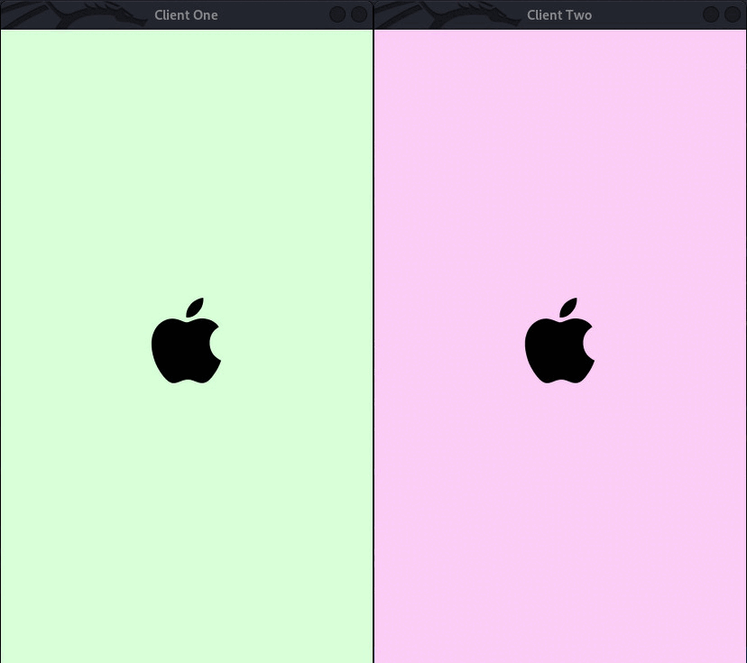

# <p align = "center">A Phone Call</p>

<p align="center">
<a href="https://github.com/SusheelThapa/A-Phone-Call/blob/master/LICENSE" target="blank">

</a>
<a href="https://github.com/SusheelThapa/A-Phone-Call/fork" target="blank">

</a>
<a href="https://github.comSusheelThapa/A-Phone-Call/stargazers" target="blank">

</a>
</p>

<!-- Short introduction about Project -->
A Phone Call is all about demostrating the simulation of how phone call  works between two clients in real world and how everything is controlled and managed by server at the backend of the communication.

## Table of Contents

- [Objectives](#objectives)
- [Glimpse of the Project](#glimpse-of-the-project)
- [Tools we have used](#tools-we-have-used)
- [Installation of Dependencies](#installation-of-dependencies)
- [Project Compilation](#project-compilation)
- [How does it works?](#how-does-it-works)
- [Author](#authors)
- [Others](#others)

## Objectives

## Glimpse of the project

<!-- Here, we will have the gif of the project -->
)


## Tools we have used

1. [Visual Studio Code](https://code.visualstudio.com/): As our code editor
2. [g++](https://www.msys2.org/): As our compiler
3. [SDL2](https://www.libsdl.org/download-2.0.php) : As our Library to create GUI interface
4. [Git](https://git-scm.com/) : As our local version control system
5. [Github](https://github.com/) : As our central version control system
6. [Latex](https://www.latex-project.org/) : As our document preparation software

## Installation of Dependencies

This project has been created and tested in **linux platform**.

1. First of all give `install.sh` file executable permission

   ```terminal
   chmod +x install.sh
   ```

   _Note:Make sure you are in the place which has `install.sh`_

2. Run `install.sh`

   ```terminal
   ./install.sh
   ```

   _Give it sometime it will install all the dependencies required by the project. When it completed you can head over to [Project Compilation](#project-compilation)_

## Project Compilation

### _Basic Command_

1. Compiling Client Code

   ```make
    make client_one client_two
   ```

   _It will create two client `client_one` and `client_two`._

2. Compiling Server Code

   ```make
    make server
   ```

   _It will create `server`._

3. Clean command

   ```make
    make clean
   ```

### _Helping Command_

4. Compiling `client_one` and running

   ```make
   make client_one_run
   ```

5. Compiling `client_two` and running

   ```make
   make client_two_run
   ```

6. Compile `client_one`, `client_two` and `server` at once

   ```make
   make all
   ```

7. Run `server`, `client_one` and `client_two` at once.

   ```make
   make run
   ```

## How does it works?

<p align="center">
   
</p>

**IMPORTANT**

`server`, `client_one` and `client_two` have their own file which they check if they have been changed or not.

- When `client_one` calls `client_two`

  `client_one` will send message to server(by writing in the `server_file`) i.e **CALLCLIENTTWO2222222222** as can been seen from above images.

  Then, `server` will analyse if the number `client_one` is calling is of `client_two` or not.

  If the number is correct, then it will write in `client_two` file **CALLFROMCLIENTONE1111111111**

  If the number is incorrect, then it will write in `client_one` file **NUMBERUNMATCHED**

- When **dialed number is correct**(call from `client_one` to `client_two`)

  Here, `client_two` have two option.

  - To reject the call

    When `client_two` reject the calls then it will write **CALLREJECTEDBYCLIENTTWO** in `server` file.

    Then `server` will write **CALLREJECTEDFROMCLIENTTWO** in `client_one` file

  - To accept the call

    When `client_two` accept the calls then it will write **CALLRECEIVEDBYCLIENTTWO** in `server` file.

    Then `server` will write **CALLRECEIVEDFROMCLIENTTWO** in `client_one` file

- When `client_two` accept call from `client_two`

  Both of the **client** can send _audio message to each other_ one at a time.

  Suppose `client_one` has send _audiomessage_ to `client_two`.

  Then, `client_one` will write **AUDIOMESSAGESENDBYCLIENTONE** in `server` file.

  After that, `server` will write **AUDIOMESSAGESENDFROMCLIENTONE** in `client_two` file.

_Note: All the above explanation is based from `client_one` to `client_two`. The explanation is true from `client_two` to `client_one`. Also, we have explain only how client communicates but not what happen after the message is receive by respective client_

## Authors

- [Saurav Kumar Mahato](https://github.com/SauravKumarMahato)
- [Susheel Thapa](https://github.com/SusheelThapa)

### Helping Hands

- [Utsav Manandhar](https://github.com/Utsav-Manandhar)
- [Nabin Khanal](https://github.com/khanalnabin)
- [Suprim Devkota](https://github.com/SuprimDevkota)

## Others

You can find the screenshot of the project [here](/resources/markdown/screenshot.md).

For more information, you can look [here](/resources/markdown/information.md).
